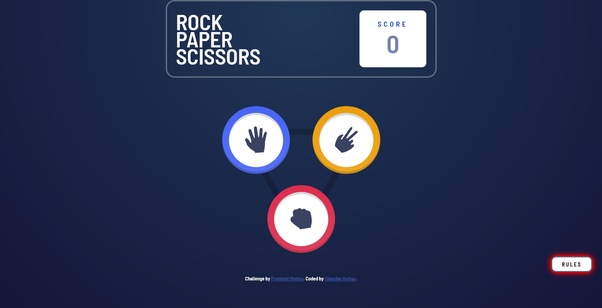
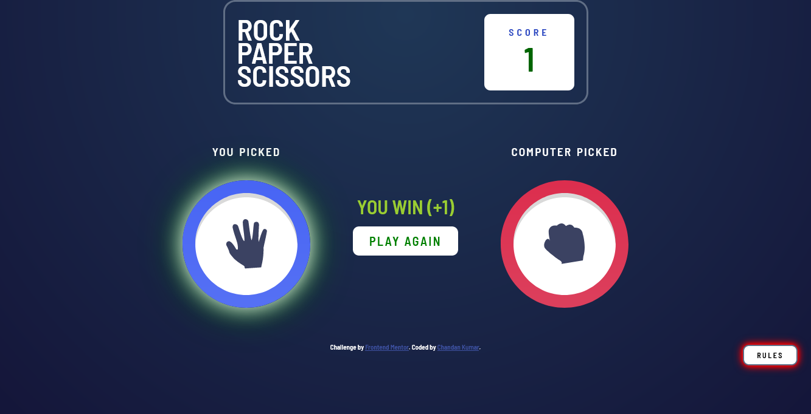
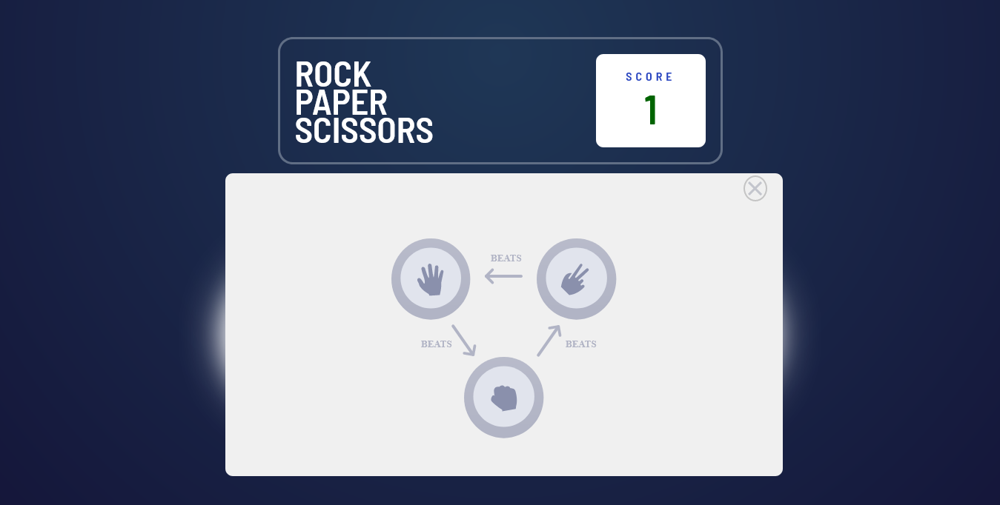

# Hi, I'm Chandan Kumar ! 👋

  
# **Title: Rock_Paper_Scissors (JS Mini Project)**

## **Table of Contents:**

1. [Live Website Link](#live-website-link)
2. [Project Description](#project-description)
3. [Rules](#rules)
4. [Built With](#built-with)
5. [Colors Used](#colors-used)
6. [Fonts Used](#fonts-used)
7. [Screenshots](#screenshots)
8. [Author](#author)
9. [Deployment And Hosting](#deployment-and-hosting)
10. [Optimizations And Future Scope](#optimizations-and-future-scope)
11. [Feedbacks or Suggestions](#feedbacks-or-suggestions)
12. [Contact Me](#contact-me)
13. [License](#license)
14. [Special Thanks](#special-thanks)
15. [Acknowledgements](#acknowledgements)

## **Live Website Link:**
=> Link -->[ Rock-Paper-Scissors](https://rock-paper-scissors-by-chandan.netlify.app/)

***[⬆ back to top](#table-of-contents)***

## **Project Description:**
> This is my second mini project based on HTML, CSS and JavaScript in which their is one ***Home Landing*** page where user can choose between ***Rock, Paper and Scissor***, the other section is ***Winner Selection*** section where the choices of user and computer is visible with the winner declaration and the score update too. This Score update section can be seen in Home Landing page too. Their is a button which shows the ***Rules*** of the game. 

***[⬆ back to top](#table-of-contents)***

## **Rules**
>- If the player wins, they gain 1 point. If the computer wins, the player loses one point.

- #### Originality

  - Paper beats Rock
  - Rock beats Scissors
  - Scissors beats Paper

***[⬆ back to top](#table-of-contents)***
  
## **Built With:**

- **HTML 5**
```html
<h1>Some HTML code I'm proud of</h1>
```

- **CSS 3**
```css
.proud-of-this-css {
  color: rgb(34, 56, 34);
}
```

- **JavaScript**
```js
const proudOfThisFunc = () => {
  console.log('🎉')
}
```

***[⬆ back to top](#table-of-contents)***

## **Colors Used:**
#### => Primary:

- Scissors Gradient: hsl(39, 89%, 49%) to hsl(40, 84%, 53%)
- Paper Gradient: hsl(230, 89%, 62%) to hsl(230, 89%, 65%)
- Rock Gradient: hsl(349, 71%, 52%) to hsl(349, 70%, 56%)
- Lizard Gradient: hsl(261, 73%, 60%) to hsl(261, 72%, 63%)
- Cyan: hsl(189, 59%, 53%) to hsl(189, 58%, 57%)

#### => Neutral:

- Dark Text: hsl(229, 25%, 31%)
- Score Text: hsl(229, 64%, 46%)
- Header Outline: hsl(217, 16%, 45%)

#### => Background:

- Radial Gradient: hsl(214, 47%, 23%) to hsl(237, 49%, 15%)

***[⬆ back to top](#table-of-contents)***


## **Fonts Used:**
- Family: [Barlow Semi Condensed](https://fonts.google.com/specimen/Barlow+Semi+Condensed)
- Weights: 600, 700

***[⬆ back to top](#table-of-contents)***

## **Screenshots:**

> - **Home Landing:**



> - **Winner and Score Section:**



> - **Rules Section:**



***[⬆ back to top](#table-of-contents)***
  
## **Author:**

- [Chandan Kumar](https://github.com/IronMan2606)

***[⬆ back to top](#table-of-contents)***

  
## **Deployment And Hosting:**

=> To deploy this project run, I have used [Netlify.com](https://www.netlify.com/).

***[⬆ back to top](#table-of-contents)***

  
## **Optimizations And Future Scope**

=> I would like to add some more features like "Best of Three" concept, Dark theme toogling, etc. and I will work on more smoothness and interaction of the elements in future for sure.

***[⬆ back to top](#table-of-contents)***
  
## **Feedbacks or Suggestions:**

--> If you have any feedback or any suggestion regarding this project, please reach out to me at krchandan0626@gmail.com

***[⬆ back to top](#table-of-contents)***

  
## **Contact Me:**
[](https://www.linkedin.com/in/chandan-kumar-794a42133/)
[](https://twitter.com/Chandan_2606)

***[⬆ back to top](#table-of-contents)***

  
## **License:**

--> [MIT](https://choosealicense.com/licenses/mit/)

***[⬆ back to top](#table-of-contents)***

## **Special Thanks:**
- [Mentor - Ankeet Kumar Hanny](https://www.linkedin.com/in/ankeethanny007/)
- [Newton School](https://www.newtonschool.co/)

***[⬆ back to top](#table-of-contents)***

## **Acknowledgements:**
- [Fronend Mentor](https://www.frontendmentor.io/)
- [developer.mozilla.org](https://developer.mozilla.org/en-US/docs/Web/CSS)
- [W3School](https://www.w3schools.com/)
- [YouTube](https://www.youtube.com/)

***[⬆ back to top](#table-of-contents)***
  
